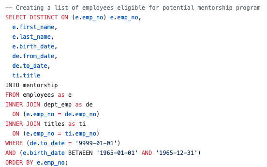

# Pewlett-Hackard-Analysis

## Background and Purpose
In this module Structure Query Languag aka SQL to create a database in postgres which conatined multiple tables showing the relationship or foreign and primary keys. The reason this database was created was in order to find out the number of retiring employees per title, and identify those employees who are eligible to participate in a mentorship program.

## Analysis

First we had to remove duplicate rows by :

Next we had create a list of eligble employees for mentorship program :

There are :
* 1545 mentorship eligible employees

* 7 unique retiring titles on the other hand

* 90395 unique titles

Frome these two graphics screenshots below we can clearly see the percent retirees and eligible employees :

% Retired           |  # Eligble
:-------------------------:|:-------------------------:
  |  

## Results / Conclusion

1. How many roles will need to be filled as the "silver tsunami" begins to make an impact?
* Once the "silver tsunami" begins to make an impact there will be over 90k roles needing to be filled once all of the retirees have left meaning that all the mentors will have roles to fill when the it does begin to make an impact

2. Are there enough qualified, retirement-ready employees in the departments to mentor the next generation of Pewlett Hackard employees?
* Once the mentors are ready there is enough retiring employees to mentor the employees eligible for the mentorship program.

